# 🗺️ **DIAGRAMA RELACIONAL MERMAID - BASE DE DATOS 4GMOVIL**

## 📊 **DIAGRAMA COMPLETO DEL SISTEMA**

```mermaid
erDiagram
    %% SISTEMA DE USUARIOS (CORE)
    usuarios {
        bigint usuario_id PK
        string nombre_usuario
        string correo_electronico UK
        string contrasena
        string telefono
        string foto_perfil
        boolean estado
        string rol
        timestamp email_verified_at
        timestamp fecha_registro
        string google_id
        string stripe_id
        string pm_type
        string pm_last_four
        timestamp trial_ends_at
        string remember_token
        timestamp created_at
        timestamp updated_at
    }

    password_reset_tokens {
        string email PK
        string token
        timestamp created_at
    }

    sessions {
        string id PK
        bigint usuario_id FK
        string ip_address
        text user_agent
        longtext payload
        integer last_activity
    }

    %% SISTEMA DE CATALOGO
    categorias {
        bigint categoria_id PK
        string nombre
        text descripcion
        string imagen_url
        boolean activo
        integer orden
        timestamp created_at
        timestamp updated_at
    }

    marcas {
        bigint marca_id PK
        string nombre
        text descripcion
        string logo_url
        boolean activo
        timestamp created_at
        timestamp updated_at
    }

    productos {
        bigint producto_id PK
        string nombre_producto
        text descripcion
        decimal precio
        integer stock
        enum estado
        integer stock_reservado
        integer stock_disponible
        bigint categoria_id FK
        bigint marca_id FK
        string imagen_url
        timestamp created_at
        timestamp updated_at
    }

    variantes_producto {
        bigint variante_id PK
        bigint producto_id FK
        string nombre
        text descripcion
        decimal precio_adicional
        integer stock
        integer stock_reservado
        boolean disponible
        string sku UK
        string referencia
        timestamp created_at
        timestamp updated_at
    }

    imagenes_variantes {
        bigint imagen_id PK
        bigint variante_id FK
        string url_imagen
        string alt_text
        integer orden
        boolean principal
        timestamp created_at
        timestamp updated_at
    }

    imagenes_productos {
        bigint imagen_id PK
        bigint producto_id FK
        string url_imagen
        string alt_text
        integer orden
        boolean principal
        timestamp created_at
        timestamp updated_at
    }

    especificaciones_categoria {
        bigint especificacion_id PK
        bigint categoria_id FK
        string nombre_campo
        string etiqueta
        enum tipo_campo
        text opciones
        string unidad
        boolean requerido
        integer orden
        boolean activo
        timestamp created_at
        timestamp updated_at
    }

    especificaciones_producto {
        bigint especificacion_producto_id PK
        bigint producto_id FK
        bigint especificacion_id FK
        text valor
        timestamp created_at
        timestamp updated_at
    }

    %% SISTEMA DE INVENTARIO
    movimientos_inventario {
        bigint movimiento_id PK
        bigint producto_id FK
        enum tipo
        integer cantidad
        string motivo
        bigint usuario_id FK
        string referencia
        timestamp fecha_movimiento
        timestamp created_at
        timestamp updated_at
    }

    movimientos_inventario_variantes {
        bigint movimiento_id PK
        bigint variante_id FK
        enum tipo
        integer cantidad
        string motivo
        bigint usuario_id FK
        string referencia
        timestamp fecha_movimiento
        timestamp created_at
        timestamp updated_at
    }

    reservas_stock_variantes {
        bigint reserva_id PK
        bigint variante_id FK
        bigint usuario_id FK
        integer cantidad
        string motivo
        timestamp fecha_expiracion
        enum estado
        string referencia_pedido
        timestamp created_at
        timestamp updated_at
    }

    %% SISTEMA DE PEDIDOS
    direcciones {
        bigint direccion_id PK
        bigint usuario_id FK
        string nombre_destinatario
        string telefono
        string calle
        string numero
        string piso
        string departamento
        string codigo_postal
        string ciudad
        string provincia
        string pais
        text referencias
        boolean predeterminada
        boolean activo
        timestamp created_at
        timestamp updated_at
    }

    estados_pedido {
        bigint estado_id PK
        string nombre
        string descripcion
        string color
        boolean activo
        integer orden
        timestamp created_at
        timestamp updated_at
    }

    metodos_pago {
        bigint metodo_id PK
        string nombre
        text descripcion
        string icono
        boolean activo
        integer orden
        timestamp created_at
        timestamp updated_at
    }

    pedidos {
        bigint pedido_id PK
        bigint usuario_id FK
        bigint direccion_id FK
        bigint estado_id FK
        datetime fecha_pedido
        decimal total
        text notas
        timestamp created_at
        timestamp updated_at
    }

    detalles_pedido {
        bigint detalle_id PK
        bigint pedido_id FK
        bigint producto_id FK
        bigint variante_id FK
        integer cantidad
        decimal precio_unitario
        decimal subtotal
        timestamp created_at
        timestamp updated_at
    }

    pagos {
        bigint pago_id PK
        bigint pedido_id FK
        decimal monto
        bigint metodo_id FK
        datetime fecha_pago
        string estado
        string referencia
        timestamp created_at
        timestamp updated_at
    }

    resenas {
        bigint resena_id PK
        bigint usuario_id FK
        bigint producto_id FK
        bigint pedido_id FK
        integer calificacion
        text comentario
        boolean verificada
        boolean activa
        timestamp created_at
        timestamp updated_at
    }

    otp_codes {
        bigint otp_id PK
        bigint usuario_id FK
        string codigo
        string tipo
        timestamp fecha_expiracion
        boolean usado
        timestamp created_at
        timestamp updated_at
    }

    %% SISTEMA DE PAGOS Y SUSCRIPCIONES
    subscriptions {
        bigint subscription_id PK
        bigint usuario_id FK
        string name
        string stripe_id UK
        string stripe_status
        string stripe_price
        integer quantity
        timestamp trial_ends_at
        timestamp ends_at
        timestamp created_at
        timestamp updated_at
    }

    subscription_items {
        bigint subscription_item_id PK
        bigint subscription_id FK
        string stripe_id UK
        string stripe_product
        string stripe_price
        integer quantity
        timestamp created_at
        timestamp updated_at
    }

    %% RELACIONES PRINCIPALES
    usuarios ||--o{ direcciones : "tiene"
    usuarios ||--o{ pedidos : "realiza"
    usuarios ||--o{ resenas : "escribe"
    usuarios ||--o{ otp_codes : "genera"
    usuarios ||--o{ subscriptions : "tiene"
    usuarios ||--o{ sessions : "mantiene"
    usuarios ||--o{ movimientos_inventario : "registra"
    usuarios ||--o{ movimientos_inventario_variantes : "registra"
    usuarios ||--o{ reservas_stock_variantes : "reserva"

    categorias ||--o{ productos : "contiene"
    categorias ||--o{ especificaciones_categoria : "define"

    marcas ||--o{ productos : "produce"

    productos ||--o{ variantes_producto : "tiene"
    productos ||--o{ imagenes_productos : "muestra"
    productos ||--o{ especificaciones_producto : "tiene"
    productos ||--o{ detalles_pedido : "incluye"
    productos ||--o{ resenas : "recibe"
    productos ||--o{ movimientos_inventario : "registra"

    variantes_producto ||--o{ imagenes_variantes : "muestra"
    variantes_producto ||--o{ movimientos_inventario_variantes : "registra"
    variantes_producto ||--o{ reservas_stock_variantes : "reserva"
    variantes_producto ||--o{ detalles_pedido : "incluye"

    pedidos ||--o{ detalles_pedido : "contiene"
    pedidos ||--o{ pagos : "genera"
    pedidos ||--o{ resenas : "permite"

    direcciones ||--o{ pedidos : "usa"

    estados_pedido ||--o{ pedidos : "define"

    metodos_pago ||--o{ pagos : "procesa"

    subscriptions ||--o{ subscription_items : "contiene"

    especificaciones_categoria ||--o{ especificaciones_producto : "valora"

    password_reset_tokens ||--|| usuarios : "resetea"
```



## 🔗 **EXPLICACIÓN DE RELACIONES**

### **1. RELACIONES 1:N (Uno a Muchos)**
- **usuarios → pedidos**: Un usuario puede tener muchos pedidos
- **categorias → productos**: Una categoría puede contener muchos productos
- **marcas → productos**: Una marca puede producir muchos productos
- **productos → variantes_producto**: Un producto puede tener muchas variantes
- **pedidos → detalles_pedido**: Un pedido puede contener muchos detalles

### **2. RELACIONES N:1 (Muchos a Uno)**
- **productos → categorias**: Muchos productos pueden pertenecer a una categoría
- **productos → marcas**: Muchos productos pueden pertenecer a una marca
- **pedidos → usuarios**: Muchos pedidos pueden pertenecer a un usuario

### **3. RELACIONES N:M (Muchos a Muchos)**
- **productos ↔ especificaciones_categoria**: A través de la tabla intermedia `especificaciones_producto`
- **usuarios ↔ productos**: A través de la tabla intermedia `resenas`

### **4. RELACIONES 1:1 (Uno a Uno)**
- **password_reset_tokens ↔ usuarios**: Un token de reset corresponde a un usuario

## 📊 **FLUJO DE DATOS PRINCIPAL**

### **🛒 FLUJO DE COMPRA**
```
usuarios → direcciones → pedidos → detalles_pedido → pagos
    ↓
productos ← categorias + marcas
    ↓
variantes_producto → imagenes_variantes
```

### **📦 FLUJO DE INVENTARIO**
```
productos → movimientos_inventario
    ↓
variantes_producto → movimientos_inventario_variantes
    ↓
reservas_stock_variantes
```

### **💳 FLUJO DE PAGOS**
```
usuarios → subscriptions → subscription_items
    ↓
pedidos → pagos → metodos_pago
```

## 🎯 **PUNTOS CLAVE DEL DIAGRAMA**

1. **Tabla Central**: `usuarios` es el núcleo del sistema
2. **Separación de Responsabilidades**: Cada sistema tiene sus propias tablas
3. **Normalización**: Estructura en 3NF sin redundancia
4. **Escalabilidad**: Fácil agregar nuevas funcionalidades
5. **Integridad**: Claves foráneas bien definidas

---

**Estado**: ✅ **DIAGRAMA COMPLETO Y FUNCIONAL**  
**Fecha**: 2025-09-01  
**Base de Datos**: **4GMovil Consolidada** 🎯
