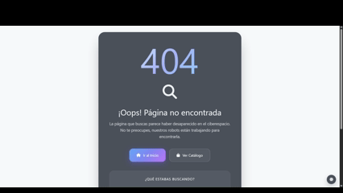
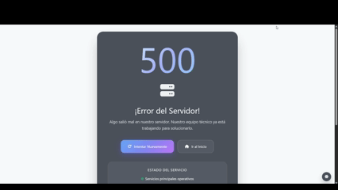
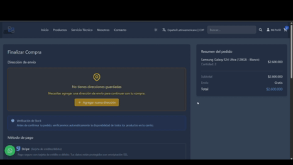
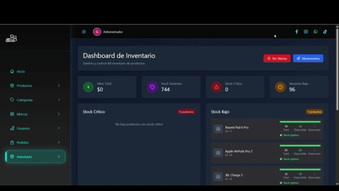

# 🚀 4GMovil - Plataforma E-commerce Moderna y Consolidada

[TOC]

## Índice

- [Estado Actual](#-estado-actual-del-proyecto)
- [Características](#-características-principales)
  - [E-commerce](#-e-commerce-completo-y-consolidado)
  - [Autenticación](#-autenticación-y-seguridad)
  - [Pagos](#-sistema-de-pagos-avanzado)
  - [Inventario](#-gestión-de-inventario-avanzada-y-consolidada)
  - [Interfaz / Modo Oscuro](#-interfaz-moderna-responsiva-y-unificada)
  - [Rendimiento](#-rendimiento-optimizado-y-consolidado)
  - [Especificaciones Dinámicas](#-sistema-de-especificaciones-dinámicas)
  - [Búsqueda en Tiempo Real](#-búsqueda-unificada-y-en-tiempo-real)
- [Stack Tecnológico](#-stack-tecnológico-actualizado)
- [Instalación](#-instalación-y-configuración)
  - [Requisitos](#requisitos-del-sistema)
  - [Guía de Instalación](#-guía-completa-de-instalación-en-nueva-pc)
  - [Verificar Instalación](#-verificar-instalación)
  - [Probar la Búsqueda](#probar-la-búsqueda)
- [Configuración de Servicios](#-configuración-de-servicios)
- [Estructura del Proyecto](#-estructura-del-proyecto-consolidado)
- [Capturas de Pantalla](#-capturas-de-pantalla)
- [Testing](#-testing-y-comandos-de-prueba)
- [Despliegue](#-despliegue-en-producción)
- [Monitoreo y Mantenimiento](#-monitoreo-y-mantenimiento)
- [Contribución](#-contribución)
- [Documentación Adicional](#-documentación-adicional)
- [Solución de Problemas](#-solución-de-problemas)
- [Licencia](#-licencia)
- [Equipo](#-equipo-de-desarrollo)
- [Soporte](#-soporte)
- [Agradecimientos](#-agradecimientos)

[](https://laravel.com)
[](https://php.net)
[](https://tailwindcss.com)
[](https://vitejs.dev)
[](LICENSE)

**4GMovil** es una plataforma e-commerce moderna, robusta y completamente consolidada construida con Laravel 12, diseñada para ofrecer una experiencia de compra excepcional con gestión avanzada de inventario, integración de pagos con Stripe, autenticación social con Google y un sistema de especificaciones dinámicas para productos.

## 🎉 **ESTADO ACTUAL DEL PROYECTO**

✅ **CONSOLIDACIÓN COMPLETADA AL 100%**  
✅ **BASE DE DATOS FUNCIONANDO PERFECTAMENTE**  
✅ **SEEDERS CORREGIDOS Y FUNCIONANDO**  
✅ **SISTEMA DE ESPECIFICACIONES DINÁMICAS IMPLEMENTADO**  
✅ **VISTAS UNIFICADAS Y OPTIMIZADAS**  
✅ **MODO OSCURO COMPLETAMENTE IMPLEMENTADO**  
✅ **SISTEMA LISTO PARA PRODUCCIÓN**

**Fecha de última actualización**: Septiembre 2025  
**Estado**: ✅ **COMPLETAMENTE FUNCIONAL Y OPTIMIZADO**

## ✨ **Características Principales**

### 🛍️ **E-commerce Completo y Consolidado**
- Catálogo de productos con categorías y marcas
- **Sistema de especificaciones dinámicas por categoría**
- Sistema de carrito de compras avanzado
- Proceso de checkout optimizado con variantes
- Gestión de pedidos en tiempo real
- Sistema de reseñas y calificaciones
- **Vistas unificadas y optimizadas**

### 🔐 **Autenticación y Seguridad**
- Login tradicional con email/contraseña
- **Google OAuth 2.0** completamente integrado
- Verificación de email obligatoria
- Sistema de roles (Admin/Cliente)
- Recuperación de contraseña segura
- Protección CSRF y validación robusta

### 💳 **Sistema de Pagos Avanzado**
- **Integración completa con Stripe**
- Soporte para múltiples métodos de pago
- Webhooks configurados para eventos de pago
- Moneda: Pesos Colombianos (COP)
- Manejo seguro de transacciones
- **Sistema de suscripciones implementado**

### 📊 **Gestión de Inventario Avanzada y Consolidada**
- Control de stock en tiempo real
- Stock disponible vs stock reservado
- **Sistema de alertas automáticas para stock bajo**
- Movimientos de inventario con trazabilidad completa
- Reportes exportables (PDF/Excel)
- Dashboard de métricas en tiempo real
- **Sincronización automática de stock con variantes**

### 🎨 **Interfaz Moderna, Responsiva y Unificada**
- **Tailwind CSS 3.4.17** con tema personalizado y extensiones
- **Modo oscuro completamente implementado** (persistente vía localStorage, incluyendo páginas de error y componentes UI)
- Diseño mobile-first y responsive
- **Vistas consolidadas y optimizadas**
- Animaciones CSS personalizadas (@keyframes, transiciones suaves, entrada/salida)
- Componentes reutilizables con clases utilitarias (@apply) y diseño coherente
- Adaptado y optimizado para dispositivos móviles

### ⚡ **Rendimiento Optimizado y Consolidado**
- **Vite 7.1.5** como bundler ultrarrápido para desarrollo y producción
- **Migraciones consolidadas (84% menos archivos)**
- Lazy loading de imágenes
- Code splitting automático con importación dinámica
- Compresión Gzip/Brotli lista para producción (vite-plugin-compression)
- Caché inteligente del navegador y recursos versionados
- Middleware de optimización personalizado

### 🔧 **Sistema de Especificaciones Dinámicas**
- **Especificaciones por categoría de producto**
- **Formularios dinámicos en tiempo real**
- **Filtros avanzados basados en especificaciones**
- **API endpoints para especificaciones**

### 🔎 **Búsqueda Unificada y en Tiempo Real**
- Barra de búsqueda con autocompletado en tiempo real (Alpine.js + endpoint JSON)
- Resultados combinados: productos y páginas estáticas del sitio
- Atajo de teclado `/` para enfocar el buscador
- Enlace "Ver todos los resultados" hacia la página de resultados completos

Endpoints:

```http
GET /buscar                 # Página de resultados completos (param: q)
GET /buscar/sugerencias     # JSON con sugerencias (param: q)
```

Detalles de implementación:
- Productos: búsqueda por `nombre_producto` y por relaciones `categoria.nombre`, `marca.nombre`
- Páginas: lista curada validada con `Route::has()` y keywords normalizadas (sin acentos, minúsculas)
- Esquema de imágenes: se usa la imagen principal activa (scopes), con `url_completa` del modelo `ImagenProducto`
- **Comandos Artisan para gestión**

## 🛠️ **Stack Tecnológico Actualizado**

### **Backend**
- **Laravel 12.0** - Framework PHP moderno
- **PHP 8.2+** - Versión mínima requerida
- **MySQL/SQLite** - Base de datos consolidada
- **Eloquent ORM** - ORM robusto de Laravel
- **Arquitectura Repository Pattern**
- **Sistema de migraciones consolidado**

Notas importantes de esquema (usadas por la búsqueda y otras vistas):
- Tabla `productos` usa clave primaria `producto_id`
- Tabla `categorias` usa clave primaria `categoria_id`
- Tabla `marcas` usa clave primaria `marca_id`
- Tabla `imagenes_productos` usa clave primaria `imagen_id` y columna de ruta `ruta_imagen`

### **Frontend**
- **Vite 7.1.5** - Bundler moderno y rápido  
- **Tailwind CSS 3.4.17** - Framework CSS utility-first :contentReference[oaicite:0]{index=0}  
- **Alpine.js 3.15.0** - Framework JavaScript ligero :contentReference[oaicite:1]{index=1}  
- **Axios 1.12.2** - Cliente HTTP optimizado  

### **Integraciones**
- **Stripe** - Pasarela de pagos completa
- **Google OAuth** - Autenticación social
- **SMTP/Gmail** - Servicio de email
- **Postmark/AWS SES** - Email transaccional

### **Herramientas de Desarrollo**
- **PHPUnit 11.5.3** — Testing robusto para Laravel
- **Laravel Pint 1.13** — Formateo de código con estándares Laravel
- **Laravel Pail 1.2.2** — Monitoreo en tiempo real de logs en consola
- **Laravel Boost 1.0** — Optimización de autoload para desarrollo local
- **ESLint + Prettier** — Calidad de código JS/CSS
- **Composer + NPM** — Gestión eficiente de dependencias

## 🚀 **Instalación y Configuración**

### **Requisitos del Sistema**
- PHP 8.2 o superior
- Composer 2.0+
- Node.js 18.0+
- MySQL 8.0+ o SQLite
- Servidor web (Apache/Nginx)

### **📋 Guía Completa de Instalación en Nueva PC**

#### **1. Clonar el Repositorio**
```bash
git clone https://github.com/tu-usuario/4gmovil.git
cd 4gmovil
```

#### **2. Instalar Dependencias**
```bash
# Dependencias PHP
composer install

# Dependencias JavaScript
npm install
```

#### **3. Configurar Variables de Entorno**
```bash
cp .env.example .env
```

**Editar `.env` con tu configuración:**
```env
APP_NAME="4GMovil"
APP_ENV=local
APP_KEY=
APP_URL=http://127.0.0.1:8000

# Base de Datos
DB_CONNECTION=mysql
DB_HOST=127.0.0.1
DB_PORT=3306
DB_DATABASE=4gmovil_db
DB_USERNAME=tu_usuario
DB_PASSWORD=tu_contraseña

# Email
MAIL_MAILER=smtp
MAIL_HOST=smtp.gmail.com
MAIL_USERNAME=tu-email@gmail.com
MAIL_PASSWORD=tu-app-password

# Google OAuth
GOOGLE_CLIENT_ID=tu-google-client-id
GOOGLE_CLIENT_SECRET=tu-google-client-secret
GOOGLE_REDIRECT_URI=http://localhost:8000/auth/callback/google

# Stripe
STRIPE_KEY=pk_test_...
STRIPE_SECRET=sk_test_...
STRIPE_WEBHOOK_SECRET=whsec_...

# Configuración Bancaria (opcional)
BANK_ACCOUNT=tu_cuenta_bancaria
BANK_NAME=nombre_del_banco
```

#### **4. Generar Clave de Aplicación**
```bash
php artisan key:generate
```

#### **5. Configurar Base de Datos**
```bash
# Ejecutar migraciones consolidadas
php artisan migrate:fresh --seed

#### **6. Construir Assets Frontend**
```bash
npm run build

En desarrollo, para ver cambios de frontend en caliente:

```bash
npm run dev
```
```

#### **7. Iniciar Servidor de Desarrollo**
```bash
# Terminal 1: Servidor PHP
php artisan serve

# Terminal 2: Servidor de desarrollo (opcional)
npm run dev
```

### **🎯 Datos que se Crean Automáticamente**

Al ejecutar `php artisan migrate:fresh --seed`, se crearán automáticamente:

#### **👤 Usuario Administrador**
- **Email**: `4gmoviltest@gmail.com`
- **Contraseña**: `Admin123!`
- **Rol**: `admin`
- **Estado**: Activo

#### **📦 Estados de Pedido**
- **ID 1**: Pendiente (color: #fbbf24)
- **ID 2**: Confirmado (color: #3b82f6)
- **ID 3**: Cancelado (color: #ef4444)

#### **💳 Métodos de Pago**
- **Stripe**: Pago con tarjeta de crédito/débito
- **Efectivo**: Pago en efectivo al momento de la entrega
- **Transferencia Bancaria**: Pago mediante transferencia

#### **📱 Categorías de Productos** (con EspecificacionesCategoriaSeeder)
- Smartphones
- Laptops
- Tablets
- Auriculares
- Bafles
- Smartwatches
- Accesorios

#### **🔧 Especificaciones Dinámicas por Categoría**

**Smartphones (ID: 1)** - 12 especificaciones
- Pantalla, resolución, RAM, almacenamiento, procesador, batería
- Cámaras, sistema operativo, características especiales

**Laptops (ID: 2)** - 11 especificaciones
- Pantalla, resolución, RAM, almacenamiento, procesador
- GPU, sistema operativo, batería, peso, puertos

**Tablets (ID: 3)** - 10 especificaciones
- Pantalla, resolución, RAM, almacenamiento, procesador
- Batería, cámaras, sistema operativo, conectividad

**Y más especificaciones para otras categorías...**

### **⚡ Comandos Rápidos de Configuración**

```bash
# Configuración completa en un solo comando
git clone https://github.com/tu-usuario/4gmovil.git && \
cd 4gmovil && \
composer install && \
npm install && \
cp .env.example .env && \
php artisan key:generate && \
php artisan migrate:fresh --seed && \
php artisan db:seed --class=EspecificacionesCategoriaSeeder && \
npm run build
```

### **🔍 Verificar Instalación**

```bash
# Verificar que el servidor funciona
php artisan serve

# Verificar base de datos
php artisan tinker --execute="echo 'Usuarios: ' . App\Models\Usuario::count();"
php artisan tinker --execute="echo 'Categorías: ' . App\Models\Categoria::count();"
php artisan tinker --execute="echo 'Estados de Pedido: ' . App\Models\EstadoPedido::count();"
php artisan tinker --execute="echo 'Especificaciones: ' . App\Models\EspecificacionCategoria::count();"
```

### **Probar la Búsqueda**

```
# Autocomplete (debe responder JSON 200)
GET http://localhost:8000/buscar/sugerencias?q=iphone

# Resultados completos
GET http://localhost:8000/buscar?q=iphone
```

Si no aparecen sugerencias en el header:
- Verifica en Network que `/buscar/sugerencias` responde 200 con `Content-Type: application/json`
- Revisa consola por mensajes `Buscar.sugerencias HTTP ...` o `no JSON`

### **🌐 Acceso al Sistema**

- **URL**: `http://127.0.0.1:8000`
- **Admin Panel**: `http://127.0.0.1:8000/admin`
- **Credenciales Admin**: `4gmoviltest@gmail.com` / `Admin123!`

## 🔧 **Configuración de Servicios**

### **Google OAuth 2.0**
1. Crear proyecto en [Google Cloud Console](https://console.cloud.google.com/)
2. Habilitar Google+ API
3. Crear credenciales OAuth 2.0
4. Configurar URIs de redirección
5. Agregar credenciales al archivo `.env`

### **Stripe**
1. Crear cuenta en [Stripe](https://stripe.com)
2. Obtener claves de API (pública y secreta)
3. Configurar webhook para eventos de pago
4. Agregar credenciales al archivo `.env`

### **Email (Gmail)**
1. Habilitar autenticación de 2 factores
2. Generar contraseña de aplicación
3. Configurar en archivo `.env`

## 📁 **Estructura del Proyecto Consolidado**

```
4GMovil/
├── app/
│   ├── Console/Commands/          # Comandos Artisan personalizados
│   ├── Helpers/                   # Funciones auxiliares
│   ├── Http/Controllers/          # Controladores MVC consolidados
│   ├── Interfaces/                # Contratos de repositorios
│   ├── Mail/                      # Plantillas de email
│   ├── Models/                    # Modelos Eloquent optimizados
│   ├── Notifications/             # Notificaciones del sistema
│   ├── Providers/                 # Proveedores de servicios
│   ├── Repositories/              # Implementación de repositorios
│   ├── Services/                  # Capa de servicios consolidada
│   └── Traits/                    # Traits reutilizables
├── config/                        # Configuraciones optimizadas
├── database/
│   ├── migrations/                # 12 migraciones consolidadas
│   └── seeders/                   # Seeders corregidos y funcionando
├── resources/
│   ├── views/                     # Vistas unificadas y optimizadas
│   ├── css/                       # Estilos con modo oscuro
│   └── js/                        # JavaScript optimizado
├── routes/                        # Rutas consolidadas
└── storage/                       # Archivos y logs
```

## 📸 **Capturas de Pantalla**

> Coloca tus capturas en `docs/capturas/` (crea la carpeta si no existe) o en `public/img/`. Debajo hay ejemplos de cómo referenciarlas.

### Landing (modo claro / modo oscuro)


### Búsqueda en tiempo real (header)


### Resultados de búsqueda


### Páginas de error (con soporte modo oscuro)





### Checkout y Carrito




### Panel Admin / Gestión de productos




### Nota

- Si prefieres servir imágenes desde `public/img/`, usa rutas absolutas: ``.
- Para GIFs de interacción (p. ej., alternar modo oscuro o autocomplete), colócalos como `docs/capturas/*.gif` y referéncialos igual.

## 🎯 **Funcionalidades Clave Implementadas**

### **Sistema de Usuarios Consolidado**
- Registro y login tradicional
- Autenticación social con Google
- Perfiles de usuario personalizables
- Sistema de direcciones múltiples
- Historial de pedidos completo
- **Modo oscuro en todas las vistas**

### **Gestión de Productos Avanzada**
- CRUD completo de productos
- Categorías y marcas jerárquicas
- **Sistema de especificaciones dinámicas**
- Gestión de imágenes múltiples
- Control de stock avanzado
- Sistema de reseñas y calificaciones
- **Sistema de variantes de productos**

### **Proceso de Compra Optimizado**
- Carrito de compras persistente
- Verificación de stock en tiempo real
- Checkout optimizado y seguro
- **Soporte para variantes de productos**
- Múltiples métodos de pago
- Confirmación de pedido por email

### **Panel de Administración Consolidado**
- Dashboard con métricas en tiempo real
- Gestión completa de inventario
- Control de pedidos y estados
- Gestión de usuarios y roles
- Reportes exportables
- **Sistema de alertas de stock**

### **Sistema de Especificaciones Dinámicas**
- **Formularios dinámicos por categoría**
- **Filtros avanzados en tiempo real**
- **API endpoints para especificaciones**
- **Comandos Artisan para gestión**
- **Validación automática de campos**

## 🧪 **Testing y Comandos de Prueba**

### **Ejecutar Tests**
```bash
# Tests unitarios
php artisan test --testsuite=Unit

# Tests de integración
php artisan test --testsuite=Feature

# Todos los tests
php artisan test
```

### **Comandos de Prueba Personalizados**
```bash
# Crear productos de prueba con especificaciones
php artisan productos:crear-prueba [--categoria=ID] [--cantidad=N] [--forzar]

# Agregar especificaciones a una categoría
php artisan especificaciones:agregar {categoria_id} [--forzar]

# Probar configuración de Google OAuth
php artisan google:test-config

# Verificar webhooks de Stripe
php artisan stripe:check-webhooks

# Analizar inventario
php artisan inventario:analizar

# Verificar alertas de stock
php artisan inventario:verificar-alertas
```

## 🚀 **Despliegue en Producción**

### **Preparación**
```bash
# Instalar dependencias de producción
composer install --optimize-autoloader --no-dev

# Construir assets optimizados
npm run build

# Limpiar cachés
php artisan optimize:clear
```

### **Configuración del Servidor**
- Configurar servidor web (Apache/Nginx)
- Configurar PHP-FPM
- Configurar SSL/HTTPS
- Configurar variables de entorno de producción
- Configurar base de datos de producción

### **Optimizaciones de Rendimiento**
```bash
# Optimizar autoloader
composer install --optimize-autoloader --no-dev

# Cachear configuración
php artisan config:cache

# Cachear rutas
php artisan route:cache

# Cachear vistas
php artisan view:cache
```

## 📊 **Monitoreo y Mantenimiento**

### **Logs del Sistema**
- Logs estructurados con contexto
- Rotación automática de archivos
- Niveles de log configurables
- Integración con servicios externos

### **Métricas de Rendimiento**
- Tiempo de respuesta de consultas
- Uso de memoria del servidor
- Tiempo de carga de páginas
- Errores y excepciones

### **Comandos de Mantenimiento**
```bash
# Limpiar stock reservado
php artisan inventario:limpiar-stock-reservado

# Corregir inconsistencias
php artisan inventario:corregir-inconsistencias

# Verificar alertas
php artisan inventario:verificar-alertas

# Exportar reportes
php artisan inventario:exportar-reporte
```

## 🤝 **Contribución**

1. Fork el proyecto
2. Crear una rama para tu feature (`git checkout -b feature/AmazingFeature`)
3. Commit tus cambios (`git commit -m 'Add some AmazingFeature'`)
4. Push a la rama (`git push origin feature/AmazingFeature`)
5. Abrir un Pull Request

### **Estándares de Código**
- Seguir PSR-12 para PHP
- Usar ESLint y Prettier para JavaScript
- Documentar código con PHPDoc
- Escribir tests para nuevas funcionalidades

## 📚 **Documentación Adicional**

### **📖 Guías de Configuración**
- [Guía de Optimización de Rendimiento](PERFORMANCE_OPTIMIZATION.md)
- [Configuración de Google OAuth](GOOGLE_OAUTH_SETUP.md)
- [Configuración de Webhooks de Stripe](STRIPE_WEBHOOK_SETUP.md)
- [Sistema de Especificaciones Dinámicas](DYNAMIC_PRODUCT_SPECS.md)

### **🔗 Recursos Externos**
- [Documentación de Laravel](https://laravel.com/docs)
- [Documentación de Tailwind CSS](https://tailwindcss.com/docs)
- [Documentación de Stripe](https://stripe.com/docs)
- [Google OAuth 2.0](https://developers.google.com/identity/protocols/oauth2)

### **📋 Archivos de Configuración Importantes**

#### **`.env` - Variables de Entorno**
```env
# Configuración básica
APP_NAME="4GMovil"
APP_ENV=local
APP_DEBUG=true
APP_URL=http://127.0.0.1:8000

# Base de datos
DB_CONNECTION=mysql
DB_HOST=127.0.0.1
DB_PORT=3306
DB_DATABASE=4gmovil_db
DB_USERNAME=root
DB_PASSWORD=

# Servicios externos
GOOGLE_CLIENT_ID=tu-client-id
GOOGLE_CLIENT_SECRET=tu-client-secret
STRIPE_KEY=tu-stripe-key
STRIPE_SECRET=tu-stripe-secret
```

#### **`composer.json` – Dependencias PHP**

```json
{
  "php": "^8.2",
  "laravel/framework": "^12.0",
  "laravel/cashier": "^15.7",
  "laravel/socialite": "^5.23",
  "intervention/image": "2.7",
  "mcamara/laravel-localization": "^2.3"
}


#### **`package.json` – Dependencias JavaScript**

```json
{
  "devDependencies": {
    "vite": "^7.1.5",
    "tailwindcss": "^3.4.17",
    "autoprefixer": "^10.4.16",
    "postcss": "^8.5.6",
    "postcss-nested": "^6.2.0",
    "postcss-import": "^16.0.0",
    "postcss-preset-env": "^9.6.0",
    "cssnano": "^7.1.1",
    "laravel-vite-plugin": "^2.0.1",
    "vite-plugin-compression": "^0.5.1",
    "vite-plugin-pwa": "^1.0.3",
    "eslint": "^8.57.1",
    "eslint-config-prettier": "^9.1.2",
    "eslint-plugin-prettier": "^5.0.1",
    "prettier": "^3.1.1",
    "@tailwindcss/forms": "^0.5.7",
    "@tailwindcss/typography": "^0.5.10"
  },
  "dependencies": {
    "alpinejs": "^3.15.0",
    "axios": "^1.12.2",
    "chart.js": "^4.4.0",
    "flatpickr": "^4.6.13",
    "lodash": "^4.17.21",
    "moment": "^2.29.4",
    "sortablejs": "^1.15.0",
    "sweetalert2": "^11.23.0"
  }
}


## 🐛 **Solución de Problemas**

### **Problemas Comunes**

#### **Error de Autoloader**
```bash
composer dump-autoload
```

#### **Problemas de Caché**
```bash
php artisan optimize:clear
```

#### **Problemas de Base de Datos**
```bash
php artisan migrate:fresh --seed
```

#### **Problemas de Assets Frontend**
```bash
npm run build
```

### **🔧 Problemas Específicos de Instalación en Nueva PC**

#### **Error: "Class not found"**
```bash
# Limpiar caché de Composer
composer clear-cache
composer install --no-cache
```

#### **Error: "Database connection failed"**
```bash
# Verificar configuración de base de datos
php artisan tinker --execute="DB::connection()->getPdo();"

# Si usas XAMPP, verificar que MySQL esté corriendo
# En Windows: Servicios > MySQL > Iniciar
```

#### **Error: "Permission denied" en storage/logs**
```bash
# En Windows (XAMPP)
chmod -R 755 storage/
chmod -R 755 bootstrap/cache/

# En Linux/Mac
sudo chmod -R 755 storage/
sudo chmod -R 755 bootstrap/cache/
```

#### **Error: "Vite manifest not found"**
```bash
# Reconstruir assets
npm run build

# O en modo desarrollo
npm run dev

#### **Error 500 al buscar (sugerencias)**
- Asegúrate de que los modelos usan claves primarias correctas:
  - `Producto::$primaryKey = 'producto_id'`
  - `Categoria::$primaryKey = 'categoria_id'`
  - `Marca::$primaryKey = 'marca_id'`
  - `ImagenProducto::$primaryKey = 'imagen_id'`, columna de ruta `ruta_imagen`
- Si ves `Unknown column 'id'`: revisa selects y relaciones para que usen los nombres anteriores

#### **No cargan imágenes en sugerencias**
- Verifica que existan imágenes activas/principales en `imagenes_productos`
- Las URLs se construyen con `ImagenProducto::url_completa` (usa `asset('storage/...')` cuando aplica)
```

#### **Error: "Seeder not found"**
```bash
# Verificar que el seeder existe
php artisan make:seeder EspecificacionesCategoriaSeeder

# Ejecutar seeder específico
php artisan db:seed --class=EspecificacionesCategoriaSeeder
```

### **📋 Checklist de Verificación**

Después de la instalación, verifica que:

- [ ] El servidor inicia sin errores: `php artisan serve`
- [ ] La base de datos está conectada: `php artisan tinker --execute="DB::connection()->getPdo();"`
- [ ] Los seeders se ejecutaron correctamente: `php artisan tinker --execute="echo 'Usuarios: ' . App\Models\Usuario::count();"`
- [ ] Las especificaciones dinámicas cargan: `php artisan tinker --execute="echo 'Especificaciones: ' . App\Models\EspecificacionCategoria::count();"`
- [ ] Los assets se construyeron: `npm run build`
- [ ] Puedes acceder al admin: `http://localhost:8000/admin`
- [ ] Las credenciales admin funcionan: `4gmoviltest@gmail.com` / `Admin123!`
- [ ] Las especificaciones dinámicas cargan: Crear un producto y seleccionar categoría

### **🚨 Problemas Críticos**

#### **Si la base de datos está corrupta:**
```bash
# Backup (si hay datos importantes)
mysqldump -u usuario -p 4gmovil_db > backup.sql

# Recrear completamente
php artisan migrate:fresh --seed
php artisan db:seed --class=EspecificacionesCategoriaSeeder
```

#### **Si los assets no se cargan:**
```bash
# Limpiar completamente y reconstruir
rm -rf node_modules package-lock.json
npm install
npm run build
```

#### **Si el sistema no reconoce cambios:**
```bash
# Limpiar todos los cachés
php artisan optimize:clear
composer dump-autoload
npm run build
```

## 📄 **Licencia**

Este proyecto está bajo la Licencia MIT. Ver el archivo [LICENSE](LICENSE) para más detalles.

## 👥 **Equipo de Desarrollo**

- **Desarrollador Principal** - [Osman Gallego](https://github.com/gallego2022)
- **Contribuidores** - [Lista de contribuidores](https://github.com/gallego2022/4gmovil/graphs/contributors)

## 📞 **Soporte**

- **Issues**: [GitHub Issues](https://github.com/tu-usuario/4gmovil/issues)
- **Discusiones**: [GitHub Discussions](https://github.com/tu-usuario/4gmovil/discussions)
- **Email**: tu-email@ejemplo.com

## 🙏 **Agradecimientos**

- [Laravel](https://laravel.com) por el increíble framework
- [Tailwind CSS](https://tailwindcss.com) por el sistema de diseño
- [Stripe](https://stripe.com) por la integración de pagos
- [Google](https://developers.google.com) por la autenticación OAuth

---

**⭐ Si este proyecto te ha sido útil, por favor dale una estrella en GitHub!**

**Última actualización**: Septiembre 2025  
**Versión**: 2.0.0 - Consolidada y Optimizada  
**Estado**: ✅ **COMPLETAMENTE FUNCIONAL Y LISTO PARA PRODUCCIÓN**
